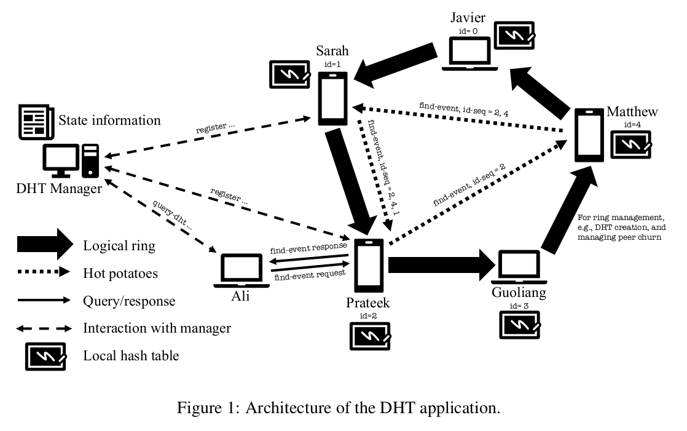

# Distributed Hash Table (DHT) with Ring Topology

This project implements a Distributed Hash Table (DHT) in C++ using socket programming for communication between multiple peers and a central manager. The DHT follows a ring topology, and the communication between peers employs a custom-designed protocol for efficient management and query processing. The project supports operations such as adding/removing peers, querying the DHT, and leader election.

## How It Works

The system consists of a DHT manager and multiple peers, each responsible for storing part of the hash table. The peers communicate with the manager to register, deregister, or join the distributed network. Communication between peers takes place via a ring topology, where each peer knows its neighboring peers and forwards messages accordingly.

The **ring topology** helps in balancing the load, and ensuring that each peer contributes to storing and querying data. Below is an illustration of the ring topology.



Each peer follows a unique identifier, and messages are passed along the ring using a "hot potato" style protocol, ensuring efficient and distributed querying across the network.

### Protocol Design

The message formats and communication protocol were custom-designed to optimize communication between the manager and peers, as well as between peers themselves. The protocol minimizes message overhead while ensuring flexibility for future extensions.

## Features

- **Peer Registration**: Peers can join or leave the distributed hash table (DHT) by communicating with the manager.
- **Leader Election**: A leader is elected among peers to handle specific tasks such as DHT setup and rebalancing.
- **Distributed Data Storage**: The DHT distributes the data across peers based on a hashing mechanism.
- **Querying Data**: Peers can query data stored across the network, with requests forwarded between peers in a ring.
- **Teardown and Rebuild**: The DHT can be cleanly torn down and rebuilt when peers leave or rejoin.
- **Efficient Communication**: A lightweight, custom-designed protocol ensures fast and reliable communication across the network.

## Project Structure

```plaintext
.
├── common/
│   └── constants.h        # Constant definitions for protocol
├── host/
│   ├── HostStrategy.h     # Host strategy for peer management and communication
│   ├── HostStrategy.cpp   # Implementation of host-side logic
│   ├── RingManager.h      # Manages peer-to-peer ring connections
│   └── RingManager.cpp    # Implementation of the ring topology
├── server/
│   ├── Server.h           # Server logic for managing peers
│   ├── Server.cpp         # Implementation of server-side logic
│   └── PeerStorage.h      # Data structure for managing registered peers
└── CMakeLists.txt         # Build configuration
```

## Installation

To compile and run the project, follow these steps:

**Clone the Repository**:

    git clone https://github.com/Rubilia/Smart-classroom-assistant.git
    cd Smart-classroom-assistant

**Install Dependencies**: Ensure you have a C++ compiler that supports C++17 and Boost Asio for networking.

    sudo apt-get install g++ cmake libboost-system-dev

**Build the Project**:

    mkdir build
    cd build
    cmake ..
    make

**Run the Server**:

    ./server <port-number>

**Run a Peer**:

    ./host <manager-ip> <manager-port>

## Contact

For any inquiries or issues, please contact:

- Name: Ilia Rubashkin
- Email: rubiliam2003@gmail.com
